# USAGE

## Bulletin Dashboard

Bulletin dashboard is where we can perform CRUD operation to the bulletins. In addition to this, we can also set status of bulletin: active (shows bulletin segment) or inactive (hide bulletin segment) and change the bulletin priority by dragging the bulletin up or down based on the priority list.

**Note: Changes will take some time to appear on the Bulletin Screen (normally 15 min), which is shown on top of bulletin Dashboard page**

### Table Of Contents

- [Add New Entry](#add-new-entry)

  - [Adding Google Slides](#adding-google-slides)

  - [Adding Other Sites](#adding-other-sites)

- [Edit Bulletin Entry](#edit-bulletin-entry)

- [Changing Bulletin Visibility](#changing-bulletin-visibility)

- [Changing Bulletin Priority](#changing-bulletin-priority)

- [Remove Bulletin Entry](#remove-bulletin-entry)

## Add New Entry

On the Bulletin Board dashboard screen, click add button on corner.

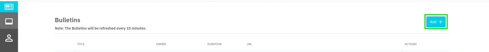

Then Add New Entry Popup will appear.

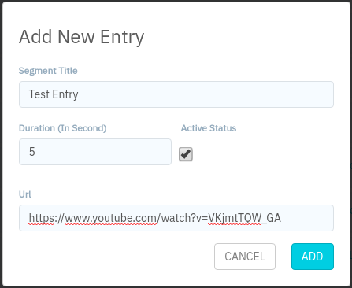

Adding new entry requires some filed.

**Segment Title:** Title which will be shown while displaying in main screen.

**Duration:** No. of Second the segment will be visible for in main screen.

**Active Status:** Whether to show bulletin segment on main screen or not.

**URL:** Link of the segment which we are willing to show for information flow.

 

### Adding Google Slides

**Step 1.** Open the Google Slides presentation you'd like to embed. In the top left corner, click File → Publish to the web.

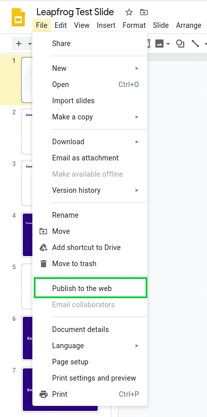

**Step 2.** In the box that pops up, choose the Embed tab. Then check the Start slideshow as soon as the player loads and Restart slide after last slide.
Then click Publish.

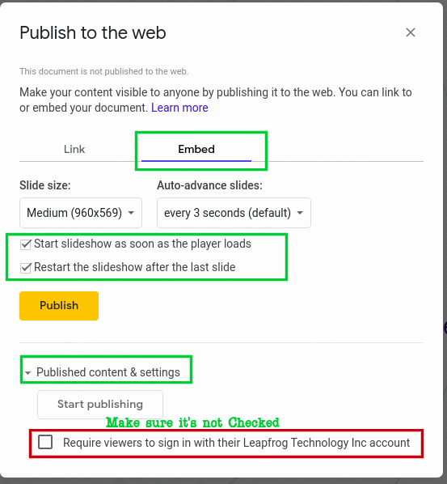

**Note:** Make sure Require viewers to sign with their Leapfrog Account is not checked.

**Step 3.** From there, on the Embed tab embed link will appear and **copy only the link inside src only without parenthesis**.

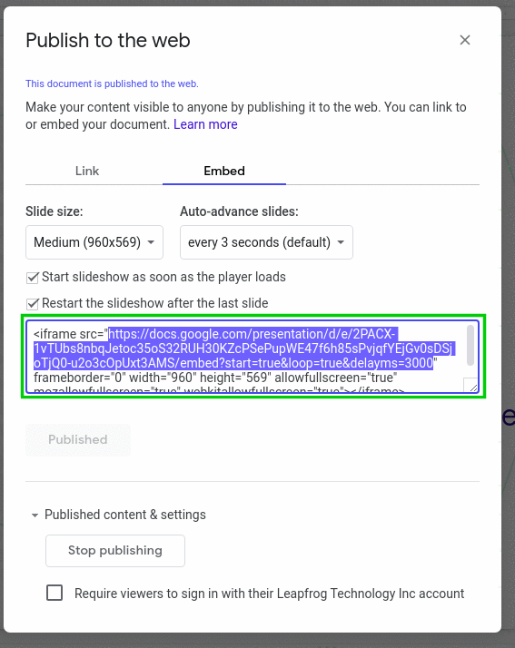

Step 4. Head back to Bulletin Board dashboard screen, click add button on corner.

Step 5. Paste in the copied link in Url section, add the title of segment, duration for how long the slide is to be shown and make sure Active Status is checked. Then click the ADD button at bottom.

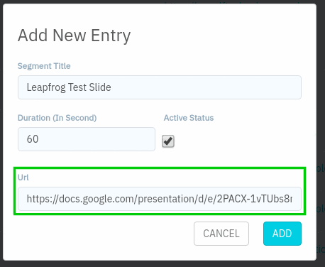

 
 

### Adding Other Sites

Websites, YouTube, Images, Videos can be added in bulletin board. Just pass in the normal/embed link on add/edit bulletin segment.

**Note:** YouTube link will be automatically converted to embedded link.

 
 

## Edit Bulletin Entry

On the Bulletin Board dashboard screen, click on the edit button on the entry you want to edit.

Then Edit Bulletin Popup will appear. Change in your requirements and click EDIT button to save your changes.

 
 

## Changing Bulletin Visibility

There are cases where we want to keep the bulletin entry but don't want to remove them but doesn't want those entry to show up in bulletin screen.

In those conditions just change active status of bulletin entry. There are 2 ways to do that.

### 1. Toggle the active status

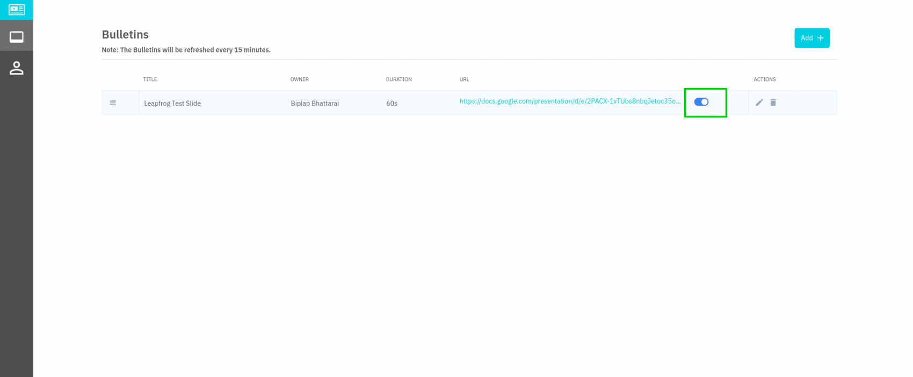

### 2. By edit method

On the Bulletin Board dashboard screen, click on the edit button on the entry you want to edit.

Then Edit Bulletin Popup will appear. Check/ uncheck the Active status.

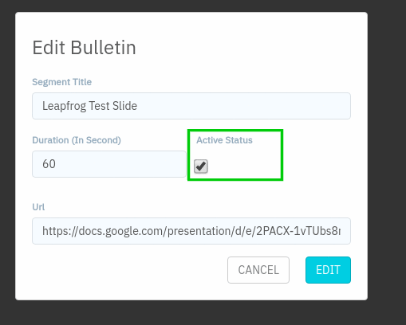

 
 

## Changing Bulletin Priority

On the Bulletin Board dashboard screen, click on side handle of the bulletin to change its list priority. Move the bulletin entry higher/lower to change the list entry on when you want to show the entry.

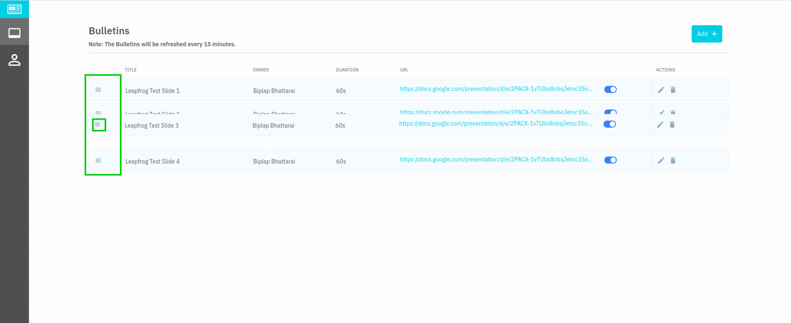

 
 

## Remove Bulletin Entry

On the Bulletin Board dashboard screen, click on the delete button on the entry you want to edit.

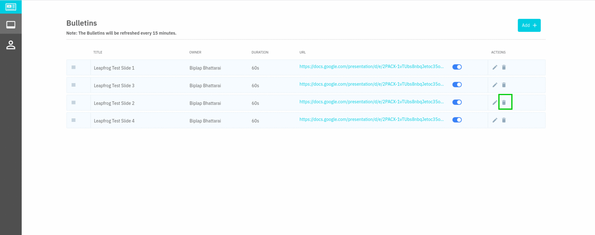

Then Delete Bulletin Popup will appear. Click OK to remove bulletin.

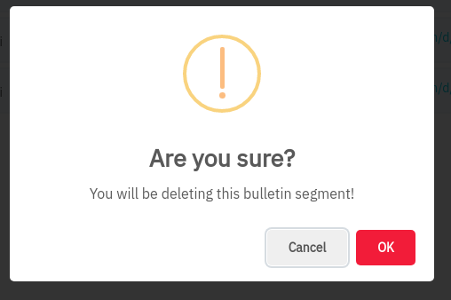
